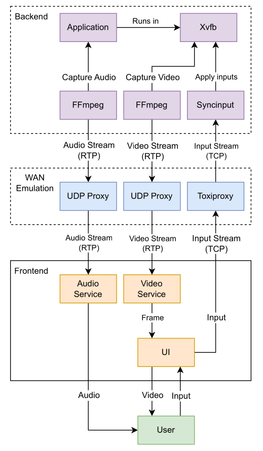

# Cloud Gaming in a Box

This project provides a Cloud-Gaming testbed that is easy to deploy, configure, extend and use, with the goal of facilitating user studies for Cloud-Gaming or remote interactive applications in general.

## Features
* **Simple setup**
  
  Besides installing dependencies and compiling, the testbed requires no additional network or system configuration.
  
* **Fully local**

  The testbed runs fully locally on a single computer without the need for VMs, multiple PCs or an internet connection.
  *Cloud Gaming in a Box* essentially provides a remote-streaming-like service that runs on the same device.

* **Run arbitrary applications**

  The testbed can run arbitrary applications with a single simple command and without any additional configuration.

* **Integrated WAN emulation**

  A set of UDP/TCP proxies emulate typical WAN properties like delay, jitter and packet loss, in order to consistently recreate custom network scenarios as if the testbed was deployed in a traditional remote server-client environment.
This lifts the need for setting up intermediate network nodes with [WANem], [tc] or [Dummynet] for WAN emulation.


## Table of Contents

<!-- vim-markdown-toc GFM -->

- [Features](#features)
- [Related Work](#related-work)
- [Setup](#setup)
- [Compatibility](#compatibility)
- [Usage](#usage)
  - [Basic usage](#basic-usage)
  - [Passing configuration options](#passing-configuration-options)
  - [Using provided wrapper scripts](#using-provided-wrapper-scripts)
  - [Running only selected subsystems](#running-only-selected-subsystems)
- [Configuration](#configuration)
- [Conducting User Surveys](#conducting-user-surveys)
  - [Procedure](#procedure)
  - [Usage](#usage-1)
- [Architecture](#architecture)
- [Running Steam Proton Games](#running-steam-proton-games)
- [Fixing Video Corruption](#fixing-video-corruption)
- [Limitations and Future Work](#limitations-and-future-work)
- [Contributing](#contributing)

<!-- vim-markdown-toc -->


## Related Work

There are various tools for low latency remote streaming like [Parsec] or [Moonlight].
The only open source Cloud-Gaming testbed that was specifically developed for academic use is [GamingAnywhere].
However, all these systems are meant to be deployed in a traditional distributed environment and do not provide means for WAN emulation on their own.
Additionally, they might require the use of proprietary services or specific hardware.
This results in a significant amount of work for setting up reliable testbed environments.

In comparison to [GamingAnywhere], this testbed is much simpler in terms of functionality and Lines-of-Code, does not contain any unnecessary features, like a portal server for game selection, includes efficient support for VSync, incorporates WAN emulation, is easily deployable, runs fully locally and requires no further setup besides installing software dependencies and compiling.

On the downside, at this moment, the testbed only supports Linux with X11 (see also [Compatibility](#compatibility)).
Additionally, GamingAnywhere supports capturing application video by injecting code into the target process and reading the framebuffer directly when it was updated.
Even though this method only works for certain frameworks, it can improve the performance and circumvent visual artifacts.
See also [Limitations and Future Work](#limitations-and-future-work).


## Setup

1. Clone the repository
2. Run `git submodule update --init --recursive`
3. Install requirements
    - **NOTE**: Requires FFmpeg 5+.
    - Arch
        ```sh
        sudo pacman -S go base-devel cmake xorg-server-xvfb virtualgl ffmpeg sdl2 xdotool
        ```
    - Ubuntu
        ```sh
        sudo apt install golang build-essential make cmake libsdl2-dev libsdl2-2.0-0 ffmpeg libavcodec-dev libavutil-dev libavformat-dev libxtst-dev xvfb
        ```
        In addition, download and install VirtualGL. See <https://virtualgl.org/vgldoc/2_1_3/#hd004001>.
4. Run `./build.sh` to compile all components


## Compatibility

The testbed only works on Linux, but all tools were written with cross-platform compatibility in
mind, so they can be ported to other platforms in a reasonable amount of time.

The exception is the backend, which is based on Xvfb, which in turn is only available on systems using X11.
The run script also needs to be adapted accordingly and might need a rewrite on platforms that do
not support Bash.


## Usage

The run-script `run.sh` performs necessary setup, creates a virtual audio sink, starts all individual components and cleans up afterwards.
To ease debugging in case of failure, it redirects the output of all components to individual log files located in the `logs/` directory.

### Basic usage

Run the testbed using: `./run.sh <application> [subsystems]`.

See also `./run.sh -h` for advanced usage.

```sh
# Warsow
./run.sh warsow

# Libre Office Calc with additional arguments
./run.sh localc "" --norestore --show
```

### Passing configuration options

The testbed can be configured using environment variables.
See [below](#configuration) for a list of available configuration options.

```sh
# Warsow with 640x480 px resolution
WIDTH=640 HEIGHT=480 ./run.sh warsow

# Warsow with VSync enabled
FRONTEND_VSYNC=true ./run.sh warsow

# Warsow with 50 ms RTT
SERVER_DELAY_MS=25 CLIENT_DELAY_MS=25 ./run.sh warsow
```

### Using provided wrapper scripts

`scenarios/` contains wrapper scripts for various example network scenarios.
`apps/` contains example scripts for starting certain applications.
`cfg/` contains some wrapper scripts for common configurations, like VSync.

```sh
# Warsow with VSync enabled
cfg/vsync.sh ./run.sh warsow

# Warsow with VSync enabled and a delay scenario
scenarios/delay1.sh cfg/vsync.sh ./run.sh warsow

# Libre Office Calc
./run.sh apps/localc.sh

# A Hat in Time with VSync enabled
cfg/vsync.sh cfg/proton.sh ./run.sh apps/hatintime.sh
```

### Running only selected subsystems

`run.sh` also supports running only specific subsystems. This can be used to specifically start and
kill only selected components of the testbed.

For example, when testing multiple network scenarios, the application and streaming components can
be run in one session, and the remaining subsystems in another session.
This allows to quickly kill and restart the "frontend" with another configuration without having to
restart the whole game.

When starting only certain subsystems, obsolete parameters have no effect and can be left empty.

```sh
# Run A Hat in Time, but only the application and streaming components ("backend")
cfg/proton.sh ./run.sh apps/hatintime.sh app,stream

# (In another terminal) Run remaining components with delay scenario 1.
scenarios/delay1.sh cfg/vsync.sh ./run.sh "" proxy,syncinput,frontend

# Press ctrl-c anytime

# Attach again with delay scenario 3, without killing the game process.
scenarios/delay3.sh cfg/vsync.sh ./run.sh "" proxy,syncinput,frontend
```


## Configuration

The `run.sh` script defines various environment variables for configuration purposes.
The following table shows all available settings and their defaults.
The `cfg/` directory contains some wrapper scripts for common configurations, like VSync, and `scenarios/` contains wrapper scripts for various example network scenarios.

See also [Usage](#usage) for examples on how to apply these settings.

| Environment variable   | Default | Description                                                                                 |
|------------------------|---------|---------------------------------------------------------------------------------------------|
| `WIDTH`                | 1920    | Horizontal resolution of the video stream                                                   |
| `HEIGHT`               | 1080    | Vertical resolution of the video stream                                                     |
| `FPS`                  | 60      | Video stream FPS                                                                            |
| `VIDEO_BITRATE`        | 25M     | Video stream bitrate                                                                        |
| `FRONTEND_VSYNC`       | false   | Enable VSync in the frontend                                                                |
| `XVFB_KEYBOARD_LAYOUT` |       | Keyboard layout to use in Xvfb. If not specified, automatically detects the current layout. |
| `SYNCINPUT_PROTOCOL`   | tcp     | Network protocol to use with syncinput. Can be *tcp* or *udp*.                              |
| `MOUSE_SENSITIVITY`    | 1       | Mouse sensitivity applied in the frontend. Experimental, does not work as expected.         |
| `USE_VIRTUALGL`        | true    | Whether to use VirtualGL. Needs to be disabled when running Vulkan applications.            |

WAN emulation settings for Audio/Video streams, i.e. from backend to frontend.

| Environment variable | Default | Description                               |
|----------------------|---------|-------------------------------------------|
| `SERVER_DELAY_MS`    | 0       | Delay in milliseconds                     |
| `SERVER_JITTER_MS`   | 0       | Maximum jitter in milliseconds            |
| `SERVER_LOSS_START`  | 0       | Probability of burst packet loss to begin |
| `SERVER_LOSS_STOP`   | 1.0     | Probability of burst packet loss to end   |

WAN emulation settings for the input stream, i.e. from frontend to backend.

| Environment variable | Default | Description                               |
|----------------------|---------|-------------------------------------------|
| `CLIENT_DELAY_MS`    | 0       | Delay in milliseconds                     |
| `CLIENT_JITTER_MS`   | 0       | Maximum jitter in milliseconds            |
| `CLIENT_LOSS_START`  | 0       | Probability of burst packet loss to begin |
| `CLIENT_LOSS_STOP`   | 1.0     | Probability of burst packet loss to end   |


## Conducting User Surveys

The `survey/run_scenarios.py` script provides a fully automatic workflow for conducting user studies using this testbed.
It might need to be adapted depending on use-case.

At the top of the script various settings are defined regarding the survey process.
This includes a list of available scenarios in addition to a baseline scenario that does not consist of any disturbances, providing the best possible experience with this setup.

Graphical dialogs and prompts are implemented using tkinter and are therefore straightforward to extend and adapt.

All data gathered will be written to CSV immediately to prevent data loss and to allow easy resuming in case of failure.


### Procedure

The procedure looks as follows:
1. Survey
2. Warm-up
3. Test scenarios - Round 1
4. Baseline
5. Test scenarios - Round 2

The script starts with a short survey about age, gender, average time spent on gaming per week, preferred game genres and preferred gaming hardware.

Afterwards, the user gets 5 minutes warm-up time with the baseline scenario to get familiar with the game.
In the last 5 seconds an alarm sound will play to notify the user that the time is almost up.

After warm-up, each of the defined test scenarios will be executed in randomized order.
Each scenario will last for one minute and ends with an alarm sound as usual.
Afterwards, the user receives a prompt to rate their QoE between 1-5 points, according to a standard MOS scale.

After all scenarios were finished, the baseline scenario will appear again for one minute, followed by a rating dialogue and a second round of scenarios.

The whole procedure takes around 30 minutes.


### Usage

Usage: `run_scenarios.py [-h] [-u USER] [-o OFFSET]`.
See also `run_scenarios.sh -h`.

The script can be run locally on the target machine or over SSH.

At the top of the script are various constants that can be adapted.

At the start, the script uses the current timestamp as random seed and user ID.
This ID will also be the filename of the generated CSV.

The `-u` option allows specifying a custom ID/seed.

The `-o` option allows specifying at which scenario the script should start.
This is useful in case of failure to continue were the process was stopped.
In that case, the `-u` option should be set to the failed session's ID.


## Architecture



The testbed is a modular stack of different software components.
It was initially based on [Cloud-Morph], hence the overall architecture is similar.
However, due to Cloud-Morph turning out to be insufficient regarding the requirements of this project, all of its components have been replaced with custom implementations, in particular the frontend has been changed from a webpage to a native application.

The backend employs Xvfb for rendering and controlling the target application in a headless environment.
Two FFmpeg instances are used for capturing and providing Audio/Video streams of the target application over RTP.
The video stream uses H.264 and the audio stream uses Opus.
The input synchronization tool (`syncinput`) receives input events from the frontend over TCP and replicates them to target application running in the headless environment.

As Xvfb does not support hardware accelerated OpenGL rendering, VirtualGL is used to run the application with hardware acceleration enabled.
Vulkan applications do not suffer from this problem and always benefit from hardware acceleration.

The frontend is a single application optimized for efficiently decoding and playing back the audio and video stream, while transmitting user inputs with minimal delay to the `syncinput` tool.

The RTP and TCP traffic is routed through a WAN emulation layer, which consists of multiple proxies relaying the incoming traffic while performing WAN emulation.
For TCP, [Toxiproxy] is used, while for UDP a [custom proxy](https://github.com/mphe/udp-wan-proxy/tree/master) has been developed.

Technically, since the testbed uses regular networking protocols, it could also be deployed in a traditional distributed server-client environment.
Even though it is possible, it is not advised to deploy this system remotely over internet, because of lacking security measures like traffic encryption.
Additionally, such a setup is not supported by the run-script and would require manual adaption.


## Running Steam Proton Games

1. Edit the game's launch configuration in steam: `PROTON_DUMP_DEBUG_COMMANDS=1 PROTON_DEBUG_DIR=$HOME %command%`
2. Run the game
3. Steam dumps corresponding run scripts to `~/proton_<user>/` (`gdb_attach`, `gdb_run`, `run`, `winedbg`, `winedbg_run`)
4. Use the generated `run` script as execution target for `run.sh`
    - Optionally, remove the line with `WINEDEBUG="-all"` from `run` script.
5. Set `USE_VIRTUALGL=false` when executing `run.sh` to disable VirtualGL.
    - Proton makes use of Vulkan, hence VirtualGL is not needed and will also not work.
    - `cfg/proton.sh` is a wrapper script that sets `USE_VIRTUALGL=false` and can be used for simplicity.


## Fixing Video Corruption

See [here](https://github.com/mphe/udp-wan-proxy/tree/master#video-corruption).


## Limitations and Future Work

Most limitations are missing features that can be added with more development time.

- Cross-platform support
  - Only Linux is supported
- Add controller support
  - Only mouse and keyboard are supported
- Automatic reconnecting after connection loss
  - Restarting single components, e.g. proxies, causes other components that are connected to lose their connection and exit
  - Hence, restarting one component often requires also restarting other components
  - Automatic reconnection should be added to solve this issue
- Change configuration during runtime
  - Currently, components must be restarted to change the configuration
  - Especially the UDP WAN proxies would profit from being able to seamlessly change configurations during runtime, similar to [Toxiproxy]
- Improve application and screen capturing performance
  - Xvfb only supports software rendering, hence VirtualGL is used
  - Still a noticeable performance degradation
  - Possible solutions
    - Inject code into target process and grab framebuffer directly, like [GamingAnywhere] does
      - Heavily dependent on the underlying framework and OS
      - Could trigger anti-cheat protection of some games
    - Create a custom VirtualGL transport plugin to grab the finished framebuffer and send it directly to FFmpeg
      - Only works for OpenGL applications, not Vulkan.
- Screen tearing in FFmpeg recording
  - FFmpeg continuously captures the screen in the virtual environment
  - When the screen updates, it might cause screen tearing that is visible in the recording
  - There is no VSync in a headless environment
  - Might not occur in Wayland?
  - Could be solved with one of the above alternative capturing solutions
- Inconsistent mouse sensitivity
  - Mouse movement is transmitted from the frontend to the backend
  - For some reason, there is faster mouse movement in the backend
- Packet loss recovery
  - The testbed does not provide any means for packet loss recovery
  - Even small amounts of packet loss result in heavy image corruption
  - Commercial Cloud-Gaming services provide means for packet loss recovery
  - Possible solutions
    - Implement in application
        - [RTP standard](https://www.rfc-editor.org/rfc/rfc4588.html) defines a framework for packet retransmission but needs manual implementation
        - Create a custom streaming service
        - Frontend tracks lost packets and asks for retransmission
        - Streaming service retransmits lost packets on a separate channel
    - Use SRT instead of RTP
      - Provides similar performance as RTP and incorporates packet retransmissions out-of-the-box
      - Supported by FFmpeg
      - Could theoretically be switched seamlessly without any additional work
- Network security
  - The testbed was intended for local use
  - Traffic is not encrypted
  - Should use TLS based protocols
- Inputs can get stuck on exit
  - If the frontend quits while a key is pressed, the corresponding key-release event is never sent
  - This causes the application in the backend to still receive inputs even though there are none
  - Happened regularly during the user study
  - Frontend should track inputs and send release-events before exiting


## Contributing

Contributions are welcome!


[WANem]: https://wanem.sourceforge.net/
[tc]: https://man7.org/linux/man-pages/man8/tc.8.html
[Dummynet]: http://info.iet.unipi.it/~luigi/dummynet/
[Parsec]: https://parsec.app/
[Moonlight]: https://moonlight-stream.org/
[GamingAnywhere]: https://gaminganywhere.org/
[Cloud-Morph]: https://github.com/giongto35/cloud-morph
[Toxiproxy]: https://github.com/Shopify/toxiproxy
